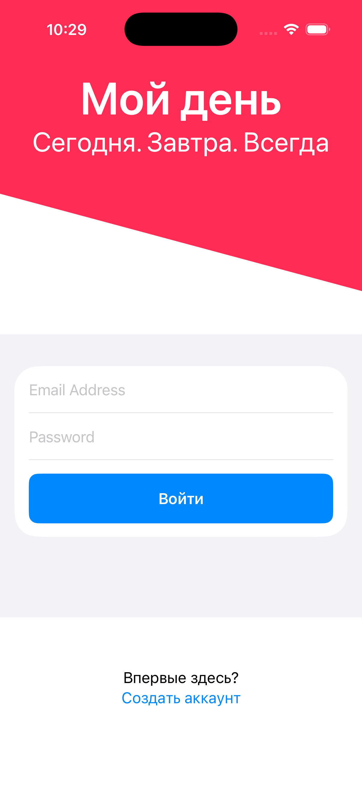
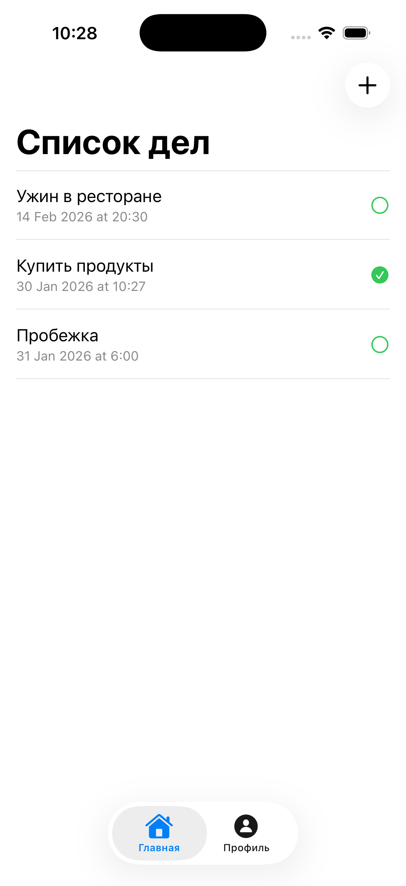

# TodoList — iOS приложение на SwiftUI + Firebase

ToDoList — это iOS-приложение для управления личными задачами, разработанное с использованием **SwiftUI** и **Firebase**.  
Приложение позволяет регистрироваться, авторизовываться, создавать задачи, отслеживать их выполнение и хранить данные в облаке.

Проект реализован с применением архитектуры **MVVM** и ориентирован на чистую, масштабируемую и поддерживаемую кодовую базу.

## Основные возможности

- Регистрация и авторизация пользователей (Firebase Authentication)
- Создание, удаление и обновление задач
- Отметка выполненных задач
- Хранение данных в Firebase Firestore
- Просмотр профиля пользователя
- Валидация пользовательского ввода
- Реактивное обновление интерфейса через Combine

## Технологии

- **Язык**: Swift
- **UI**: SwiftUI
- **Авторизация и бэкенд**: Firebase (Auth + Firestore)
- **State management**: @StateObject, @Published, Combine
- **Firestore интеграция**: @FirestoreQuery
- **Дата и время**: TimeInterval + Date formatting
- **Архитектура**: MVVM архитектура (Model–View–ViewModel)

## Структура проекта
```
ToDoList/
├── Models/               # ToDoListItem, User
├── Views/                # LoginView, RegisterView, MainView, ToDoListView, NewItemView, ProfileView, HeaderView, TLButton
├── ViewModels/           # *ViewModel для каждого экрана
└── Other/                # Assets, LaunchScreen, Extensions, GoogleService-Info, ToDoListApp
```

## Скриншоты

<p align="center">
  
  
  
  
  
</p>

## Установка и запуск

1. Клонируйте репозиторий
```
git clone https://github.com/helloGalina/ToDoList-iOS
```
2. Откройте проект в Xcode
```
open ToDoList.xcodeproj
```
3. Установить зависимости Firebase через Swift Package Manager.
4. Добавить файл GoogleService-Info.plist из Firebase Console.
5. Запустить проект на симуляторе или реальном устройстве.

## Firebase настройка

Для корректной работы приложения необходимо:

- Создать проект в Firebase Console
- Подключить:
- Firebase Authentication (Email / Password)
- Cloud Firestore
- Скачать GoogleService-Info.plist и добавить его в проект

## Планы по развитию

- Добавление приоритетов задач
- Push-уведомления
- Фильтрация и сортировка задач
- Поиск
